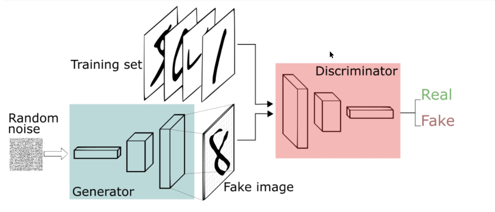

# DCGAN-MNIST

## Summary

This is a guided project from Coursera (Deep Learning with PyTorch : Generative Adversarial Network). 
A Deep Convolutional Generative Adversarial Network using PyTorch to generate handwritten digits, using dataset MNIST.

** The main difference is about the project structure, where is separate in responsibilities, without using a jupyter notebook.



### Network: Descriminator

```python
input: (bs, 1, 28, 28)

Conv2d(in_channel=1, out_channels=16, kernel_size=(3,3), stride=2)      # (bs, 16, 13, 13)
BatchNorm2d()                                                           # (bs, 16, 13, 13)
LeakyReLU()                                                             # (bs, 16, 13, 13)
    ...
Conv2d(in_channel=16, out_channels=32, kernel_size=(5,5), stride=2)     # (bs, 32, 5, 5)
BatchNorm2d()                                                           # (bs, 32, 5, 5)
LeakyReLU()                                                             # (bs, 32, 5, 5)
    ...
Conv2d(in_channel=32, out_channels=64, kernel_size=(5,5), stride=2)     # (bs, 64, 1, 1)
BatchNorm2d()                                                           # (bs, 64, 1, 1)
LeakyReLU()                                                             # (bs, 64, 1, 1)
    ...
Flatten()                                                               # (bs, 64)
Linear(in_features=64, out_features=1)                                  # (bs, 1)
```